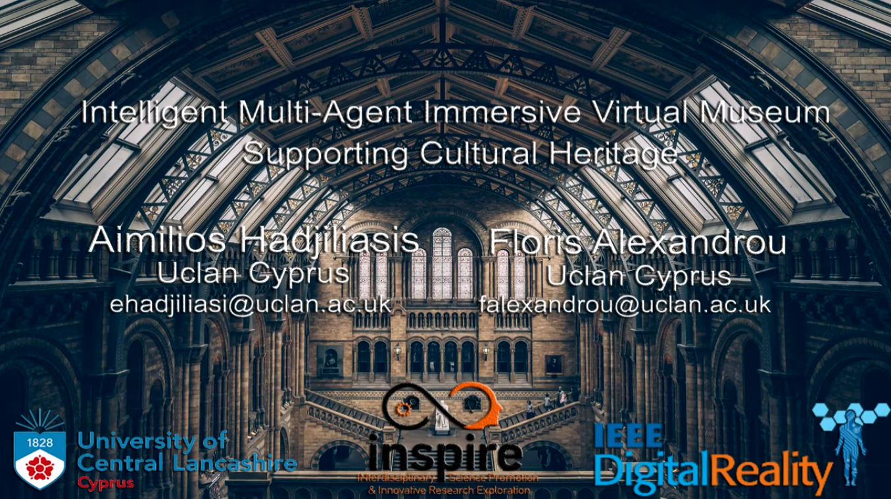
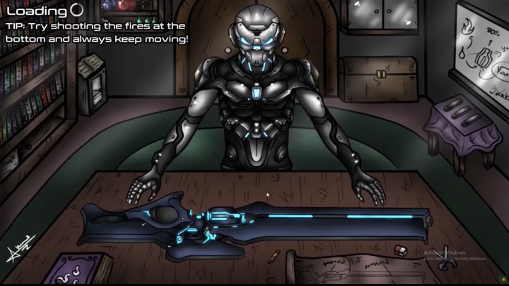
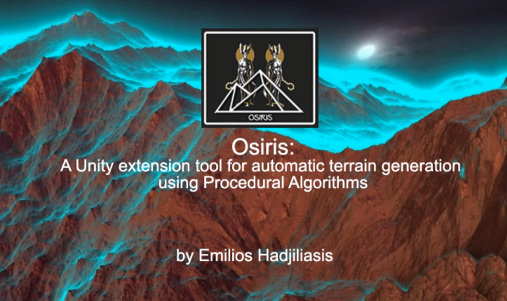
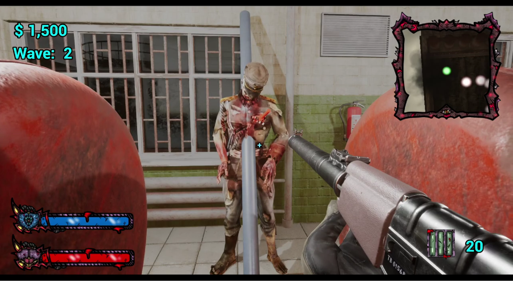
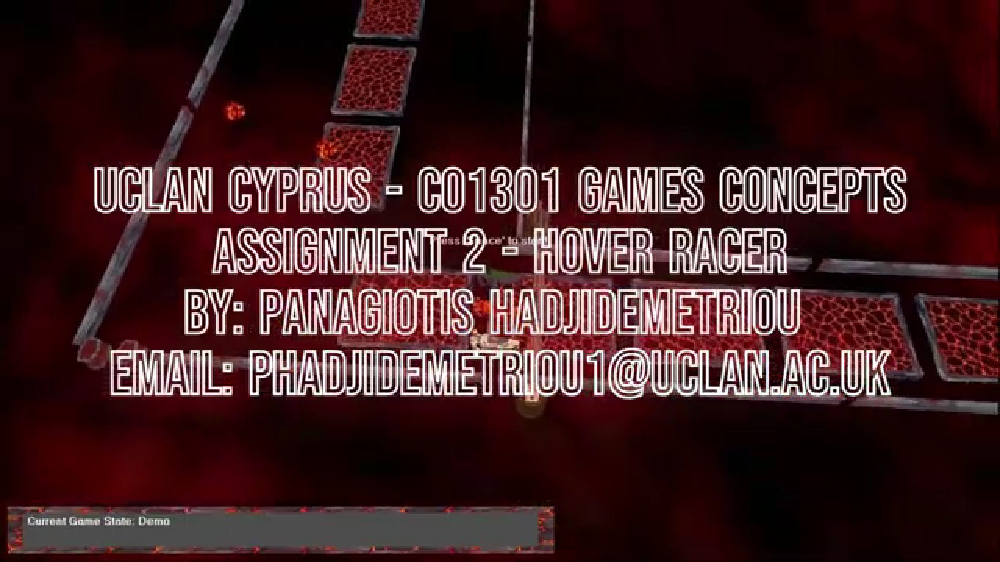

----------------------------------------------------
<h1 align="center"> 🎮 🕹️🎲 Rays and Vectors Game Studio</h1>

# About:
- 🎓 **Collaborative Development Initiative:** UCLan Cyprus, in collaboration with the InSPIRE research centre, presents the "Rays and Vectors" Game Studio.

- 🕹️ **Educational Focus:** This is our in-house, student-led game studio designed to provide a simulated workplace environment for future game developers.

- 🔄 **Workplace Simulation Environment:** The studio offers a collaborative simulation environment where UCLan Cyprus Game Development students can work independently or in teams, gaining hands-on experience in the needs and processes of the gaming industry.

- 🎮 **Skill Development:** A platform to help students develop the necessary skills to become highly skilled professional game developers.

- 🌐 **Scope of Work:**
  - Development of high-quality 3D computer games.
  - Exploration of technologies such as Virtual Reality, 3D modeling, Computer Graphics, Photogrammetry, 3D data capture and processing, and more.

 
# Culture:
- 🎮 **Immersive Learning Experience:** The studio is embedded within UCLan Cyprus Game Development culture for a dynamic educational journey.

- 🤹‍♂️ **Role Rotation and Team Dynamics:** Student teams create a self-led environment, rotating through essential roles. Gain insights into responsibilities and requirements for top-notch game development.

- 🏗️ **State-of-the-Art Facilities:** Access cutting-edge resources at the InSPIRE Centre. Utilize the latest game engines, graphics software, version control, and collaboration tools.

- 👩‍💻 **Real-World Studio Simulation:** Authentic experience of a game studio's workings. Learn project management, meet deadlines, and deliver high-quality game products.

- 🎓 **Educational Impact:** Integrated into assessments for a comprehensive understanding. Equip students with practical skills and knowledge for the gaming industry.

- 🚨 **Key Concepts Covered:** Responsibilities, roles, and processes crucial for game development. Foster a learning environment mirroring real-world challenges and expectations.

- 🌈 **Cultivating Future Game Developers:** Nurturing a talent pool with hands-on experience and a deep understanding of the gaming industry.

# Sample of Projects:
* **Intelligent Virtual Museum powered by virtual Agents**
  
   
  - **Concept:** Development of an Intelligent VR Museum to support cultural heritage and enhance user experience. 
  - Research and implementation of Multi-Agent Game-AI Algorithms
  - Use Photogrammetry to create Assets
  - Development of an open-world game-like Virtual Environment (In the form of an open Terrain Museum)
  - **Developers:** Aimilios Hadjiliasi, Floris Alexandrou
  - Find more about the project [here](https://www.youtube.com/watch?v=VicvmPAWn7k)
   

* **The Elementalists - A fast pace 3D Action and Adventure game**
  
   
  - **Concept and Gameplay:** The Elementalists’, is a fast-paced action/adventure 3D game featuring the story of 3 scientists, where each of them has experienced a tragic incident in their childhood as a result of hazards caused by human, and had to abandon their homes to save their lives. They later return as the ‘Elementalists’, an elite team who developed specialised weapons and a time machine that they can now use to teleport and relive their past to neutralise the disasters that ruined their homes. 
  * **Genre:** Fast-paced action/adventure 3D game
  - **Developer:** Nicolas Nouhi, Dimitris Dimitriou, Christoforos Nikolaou
  - Find more about the project [here](https://www.youtube.com/watch?v=PH02a6VgNDI)
   

* **The Illusionist**
  
   
  - **Concept and Gameplay:** Optical illusions challenge game developed by Konstantinos Elia as part of his BSc Computing final year project under the supervision of Dr Louis Nisiotis
  * **Genre:** Optical Illusions/Puzzle
  - **Developer:** Konstantinos Elia
  - Find more about the project [here](https://youtu.be/XY6ImzWRF20)
   
 

* **Osiris: A Unity Game Engine Procedural Terrain Generation Tool**
  
   
  - **Concept:** Development of a Tool to ease the design and development of Terrains, for Unity game Engine.
  - Algorithms Implemented as a part of the tool: Random height Algorithmm, Load heights from SAR Algorithm, Voronoi Tesselation Algorithm, Perlin Noise Algorithm, Fractal Noise Algorithm, Multi Layer Perlin Noise Algorithm, Mid Point Displacement Algorithm
  - **Developer:** Aimilios Hadjiliasi
  - Find more about the project [here](https://www.youtube.com/watch?v=W1zW2gb8Y6A)
   

* **Rise of the Night - A zombie survival game**
  
   
  - **Concept:** Development of a round based zombie survival game.
  * **Genre:** Round-based Zombie Survival
  * **Gameplay:** Survive waves of zombie attacks in differen locations. Each round introduces difficulty with more zombies and diverse types. Players must strategically navigate the environment to find weapons, ammo and resourcces.
  - **Developer:** Dimitris Dimitriou
  - Find more about the project [here](https://www.youtube.com/watch?v=jCaFH9PhsMw)
   

* **Hover Racing - A 3D racing game**
  
   
  - **Concept:** Development of 3D racing game.
  * **Genre:** 3D Racing game
  * **Gameplay:** A lap based 3D racing game where the player should compeat with 2 AI implemented NPC to win a race.
  * **Features:** Player character controllers, Particle Systems, Game-AI, Racing game mechanics
  - **Developer:** Panagiotis Hadjidemetriou
  - Find more about the project [here](https://www.youtube.com/watch?v=fpntE0oM8lg)
   

# Research Publications:

* Nisiotis, L., Hadjidemetriou, P. and Nouhi, N., 2024, June. Exploring the Time Dilation Gameplay in VR, and Its Effect on Presence, VR Sickness, and Performance. In 2024 IEEE Gaming, Entertainment, and Media Conference (GEM) (pp. 1-6). IEEE. [[Read Here]](https://ieeexplore.ieee.org/abstract/document/10585607/)
  
* Nisiotis, Louis, Anna Anikina, and Marios Raspopoulos. "Exploring Gaming Technologies, Digital Twins, and VR to Visualise Wireless Propagation Simulations." 2024 IEEE 48th Annual Computers, Software, and Applications Conference (COMPSAC). IEEE, 2024. [[Read Here]](https://ieeexplore.ieee.org/abstract/document/10633571)

* Nisiotis, L., Piki, A., Theodorou, P., Leal, S., Barradas, L.C. and Nascimento, J.A., 2024, June. Evaluation of a Serious VR Game Designed to Promote the Sustainable Development Goals. In 2024 IEEE Gaming, Entertainment, and Media Conference (GEM) (pp. 1-6). IEEE. [[Read Here]](https://ieeexplore.ieee.org/abstract/document/10585543)

* Nisiotis, L., 2024. Gaming to Learn: A Pilot Case Study on Students Acceptance of Playing Video Games as a Learning Method. EUROGRAPHICS 2024. [[Read Here]](https://diglib.eg.org/server/api/core/bitstreams/b7e9ad0c-fcac-44e5-b4fd-4647c6cc2457/content)

* Souropetsis, M., Kyza, E.A., Georgiou, Y. and Nisiotis, L., 2024. Investigating students’ immersion, motivation and cultural heritage learning in gamified and non-gamified virtual reality environments. In Proceedings of the 18th International Conference of the Learning Sciences-ICLS 2024, pp. 1602-1605. International Society of the Learning Sciences. [[Read Here]](https://repository.isls.org/handle/1/10762)

* Nisiotis, L., Hadjiliasi, A., Alexandrou, F., & Alboul, L. (2023). Interwoven Spaces with XR, AI, and Robots: Merging Realities in Space and Time. In Museums and Technologies of Presence (pp. 243-261). Routledge. [[Read Here]](https://www.taylorfrancis.com/chapters/edit/10.4324/9781003334316-17/interwoven-spaces-xr-ai-robots-louis-nisiotis-aimilios-hadjiliasi-floris-alexandrou-lyuba-alboul)

* Nisiotis, L., & Hadjiliasi, A. (2023). Work-in-Progress—Assessing the Feasibility of Playtesting Video Games Using Immersive Technologies as a Learning Method. Immersive Learning Research-Academic, 24-28. [[Read Here]](https://publications.immersivelrn.org/index.php/academic/article/view/75)

* Nisiotis, L., & Elia, K. (2023). Developing a VR Game Featuring Optical Illusion Challenges to Support Cultural Heritage-A Progress Report. In EUROGRAPHICS Workshop on Graphics and Cultural Heritage (2023). Eurographics (EG). [[Read Here]](https://diglib.eg.org/xmlui/handle/10.2312/gch20231174)

* Nisiotis, L., Souropetsis, M., & Kyza, E. A. (2023). Embracing cultural heritage through virtual reality: Development, usability and enjoyment evaluation of a vr environment for the church of panagia aggeloktisti. In International Conference on Extended Reality (pp. 227-246). Springer Nature Switzerland Cham. [[Read Here]](https://link.springer.com/chapter/10.1007/978-3-031-43404-4_15)

* Georgiou, Y., Souropetsis, M., Kyza, E. A., & Nisiotis, L. (2023). Investigating Students’ Immersion in Relation to Cultural Heritage Learning in a Virtual Reality Environment. In Proceedings of the 17th International Conference of the Learning Sciences-ICLS 2023 (pp. 1947-1948). International Society of the Learning Sciences. [[Read Here]](https://repository.isls.org/handle/1/10103)

* Souropetsis, M., Kyza, E. A., Nisiotis, L., Georgiou, Y., & Giorgalla, V. (2023). Investigating Students' Motivation and Cultural Heritage Learning in a Gamified Versus Non-gamified VR Environment. [[Read Here]](https://diglib.eg.org/handle/10.2312/imet20231255)

* Nisiotis, L. (2021). Utilising mobile game based learning methods effectively to support education. Educational Technology Research and Development, 69(1), 177-180. Springer US. [[Read Here]](https://link.springer.com/article/10.1007/s11423-020-09887-x)
